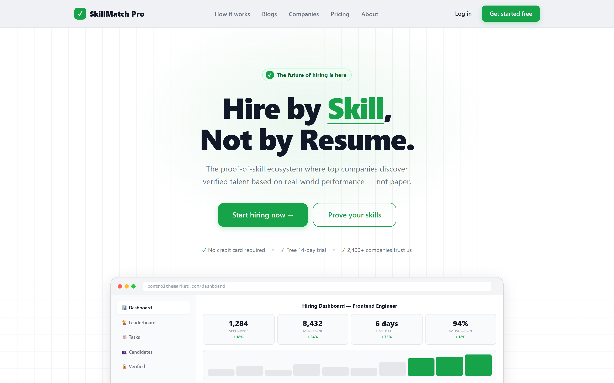

<div align="center">
  
</div>

<div align="center">

# ControlTheMarket

**Competitive talent challenges & a skill-assessment marketplace**

[](https://controlthemarket.com)
[](https://baalvion.com)
[](./LICENSE)

</div>

---

## Overview

**ControlTheMarket** turns skills into proof. It's a marketplace of competitive challenges and
skill assessments where talent competes, ranks, and gets discovered — connecting high-performers with
real opportunities.

## ✨ Features

- **Challenges** — competitive, time-boxed skill challenges
- **Assessments** — verifiable skill evaluation and scoring
- **Leaderboards** — rankings that surface top talent
- **Marketplace** — connect proven talent with opportunities
- **Payments & invoicing** — built-in monetization workflows

## 🧱 Tech stack


## 🚀 Getting started

```bash
# install dependencies
npm install

# run the dev server
npm run dev   # http://localhost:3000
```

## 🌐 Live

[controlthemarket.com](https://controlthemarket.com)

## 🏢 Part of the Baalvion ecosystem

Built and operated by **Baalvion Industries Private Limited**.
Explore the full platform → [baalvion.com](https://baalvion.com) · [@baalvionservice](https://github.com/baalvionservice)

## 📜 License

Proprietary. © 2025–2026 Baalvion Industries Private Limited. All rights reserved. See [LICENSE](./LICENSE).
